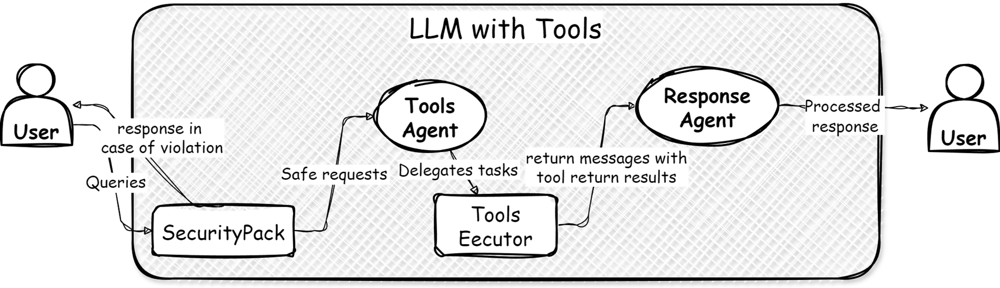

# Smart Consultant LLM 🌟  
**_LLM + LightRAG + Tools_**  

_<Все необходимые репозитории закреплены в профиле>_

---

## 📋 Содержание  
- [Smart Consultant LLM 🌟](#smart-consultant-llm-)
  - [📋 Содержание](#-содержание)
  - [🧩 Описание проекта](#-описание-проекта)
  - [🔧 Архитектура запросов (Кратко):](#-архитектура-запросов-кратко)
  - [🔑 Основные возможности системы](#-основные-возможности-системы)
  - [🛠 Временные инструменты из UserPack](#-временные-инструменты-из-userpack)
  - [🛠 Требования](#-требования)
  - [🚀 Запуск приложения](#-запуск-приложения)
  - [📝 Логирование](#-логирование)
  - [📚 Дополнительная информация](#-дополнительная-информация)
  - [🛠 Планы разработки](#-планы-разработки)
  - [🔍 Описание LightRAG](#-описание-lightrag)
  - [📜 Лицензия](#-лицензия)

---

## 🧩 Описание проекта  

Проект представляет собой модульную систему для взаимодействия с пользователями через Telegram, веб-интерфейс (и другие каналы в будущем). Основная цель — создать платформу, способную интегрировать пользовательские данные, внешние базы знаний и сложные процессы обработки информации с минимальными усилиями для разработчиков.  

**Основные особенности:**  
- 📖 Поддержка Retrieval-Augmented Generation (RAG) на базе графовой базы данных.  
- 🛠 Использование [LightRAG](https://github.com/HKUDS/LightRAG) для построения контекстно связанных ответов.  
- 🌟 Инкрементальное обновление графа для актуальности данных.  

---
## 🔧 Архитектура запросов (Кратко):  



Система состоит из двух основных агентов:  
1. **Tools Agent** — выбирает необходимые инструменты для решения запроса.  
2. **Response Agent** — обрабатывает запросы и использует результаты инструментов для формирования ответов.  

Вспомогательные модули:  
- **SecurityPack** — проверяет безопасность запросов, блокируя подозрительные инструкции.  


## 🔑 Основные возможности системы  

1. **Интеграция данных**  
   - Объединение пользовательских данных и внешних источников для создания связанных ответов.  

2. **Графовая база знаний**  
   - Эффективная работа с взаимосвязанными данными на базе LightRAG.  

3. **Модульность**  
   - Простая масштабируемость за счёт изолированных компонентов (UserPack, DBPack, интерфейсы).  

4. **Адаптация к новым данным**  
   - Инкрементальное обновление базы знаний для работы в изменяющихся условиях.  

---

## 🛠 Временные инструменты из UserPack  

Основные инструменты:  
- Поиск по базе знаний.  
- Управление счетчиками (приём, просмотр).  
- Работа с медицинскими записями.  
- Запись детей в школы.  
- Регистрация транспорта.  
- Единый запрос `get_user_info`.  
- 📄 [Подробнее об инструментах](documentation/tools_description.md).  

---

## 🛠 Требования  

1. **Установка зависимостей:**  
   ```sh  
   pip install -r requirements.txt  
   ```  
2. **Загрузка кеша базы данных:**  
   Скачайте архив с кешом базы данных и распакуйте его в корневую директорию проекта, чтобы в корне была папка ./.db_caches
   [Скачать](https://drive.google.com/file/d/1BmwmjxY6qcdbc443L1kINPpFszLWEabE/view?usp=sharing).  
3. **Telegram-бот:**  
   Следуйте инструкциям по установке Telegram бота из [репозитория](https://github.com/Bataevk/simple-telegram-bot-for-LLM).  

4. **Выбор модели:**  
  _В обоих случаях необходимо, чтобы сервер поддерживал функции (tools)_
   - Внешние API (Nvidia NIM и другие).  
   - Локальный сервер (например, Ollama).  

5. **Настройка API ключа:**
   - Установите API ключ для сервера с LLM в переменных окружения. *(при первом запуске main.py спрашивает сам)*

6. **Настройка конфигурации:**
   - Убедитесь, что в файле `config.py` указаны правильные URL сервера и модель:
     ```python
     LLM_CONFIG = {
         "base_url": "https://integrate.api.nvidia.com/v1",
         "model": "meta/llama-3.1-405b-instruct"
     }
     ```

---

## 🚀 Запуск приложения  

1. **Запуск веб-сервера:**  
   ```sh  
   python main.py --host <host> --port <port> --logs <logs>  
   ```  
    Параметры:
     - `--host`: Хост для запуска (по умолчанию: `0.0.0.0`)
     - `--port`: Порт для запуска (по умолчанию: `5000`)
     - `--logs`: Включение/выключение логирования (по умолчанию: `True`)

2. **Генерация графа:** _- не нужно при наличии кэша базы данных_ 
   ```sh  
   python ./graph_pack/graph_module.py  
   ```  
   _Для графа используются все данные госуслуг по разделам(Общие Вопросы, Недвижимость, Образование, Транспорт, Здоровье), полученные парсером ([ссылка](https://github.com/Bataevk/gosuslugi-faq-parser)). из раздела FAQ_  

3. **Интерфейс**
   Используйте *Telegram-бота* или *Web-интерфейс*


---

## 📝 Логирование  

Файлы:  
- 📂 `debug.log`  
- 📂 `error.log`  
- 📂 `info.log`  

---

## 📚 Дополнительная информация  

- **Граф:**  
  - Граф был сгенерирован на модели `llama-3.1-405b-instruct`, что обеспечило ему высокое качество.
- **Производительность:**  
  - Минимальные требования к модели: GPQA ≥30, MMLU ≥75.  
  - Рекомендуемые требования к модели: GPQA ≥50, MMLU ≥85.  

---

## 🛠 Планы разработки  

1. **Гибкая настройка инструментов.**  
2. **Улучшение модуля DBPack.**  
3. **Обновление интерфейсов.**  

---

## 🔍 Описание LightRAG  

[LightRAG](https://github.com/HKUDS/LightRAG) улучшает RAG:  
- Двухуровневое извлечение.  
- Инкрементальное обновление.  
- Интеграция графов и векторных представлений.  

_Статья: [arXiv:2410.05779](https://arxiv.org/abs/2410.05779)._  

---

## 📜 Лицензия
Проект распространяется под [Apache License](LICENSE).
