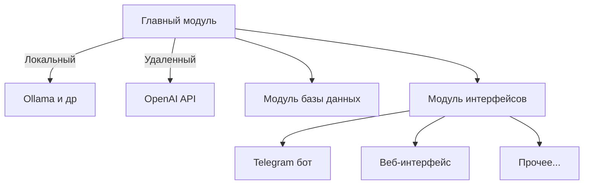
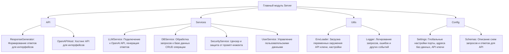

# Архитектура проекта




## Описание компонентов


### 1. **Главный модуль**  
   - Центральный элемент системы, через который проходят все запросы.  
   - Управляет логикой приложения, включает цензуру, защиту от промпт-инжекта и взаимодействие с LLM.  
   - Подключается напрямую к:  
     - **Локальным моделям** (через Ollama и другие сервисы).  
     - **Удалённым провайдерам** (таким как OpenAI API).  
---

### **Декомпозиция главного модуля**




### Описание модулей  

1. **API**  
   - **ResponseGenerator**: Формирует ответы.  
   - **OpenAPIHost**: Хостинг API (например, на FastAPI) для подключения интерфейсов.  
---
2. **Services**  
   - **LLMService**: Подключается к OpenAI API для обработки запросов пользователей.  
   - **DBService**: Взаимодействует с базой данных напрямую для управления данными и сущностями.  
   - **SecurityService**:  
      - Распознаёт повелительные инструкции и блокирует выполнение таких запросов.  
      - Отсекает запросы с запрещёнными темами и подозрительными инструкциями.   
    - **UserService**:
      - **Функции:**  
        1. Хранение и обновление данных, переданных пользователем (например, показания счётчиков).  
        2. Проверка корректности новых данных (например, значение показателя должно быть выше предыдущего).  
        3. Интерпретация свободного текста для идентификации типа показателя (горячая/холодная вода, тепло, электричество).  
        4. Обработка запросов, касающихся исторических данных.  
      - **Пример взаимодействия:**  
       1. Пользователь отправляет запрос с показаниями:  
          ```
          Горячая вода 250.12, холодная вода 300.45  
          ```
          **UserService** распознаёт типы показателей, валидирует их и сохраняет в базу данных через **DBService**.  

       2. Пользователь запрашивает данные:  
          ```
          Какие были последние показания горячей воды?  
          ```
          **UserService** ищет данные в базе и возвращает ответ.  

       3. Запрос с некорректными показателями:  
          ```
          Горячая вода 200.00  
          ```
          **UserService** отклоняет запрос, так как значение ниже предыдущего.  

3. **Utils**  
   - **EnvLoader**: Управляет переменными окружения, такими как ключи API, адреса и пароли.  
   - **Logger**: Логирует все запросы, ошибки и критические события для мониторинга и отладки.  

4. **Config**  
   - **Settings**: Глобальные параметры работы сервера, такие как порт, адреса баз данных, API ключи.  
   - **Schemas**: JSON-схемы для проверки входящих и исходящих запросов.  

---


### 2. **Модуль базы данных**  
   - Обеспечивает хранение, добавление, удаление и редактирование документов.  
   - Реализует быстрый поиск по документам.  
---
### 3. **Модуль интерфейсов**  
   - Реализует взаимодействие с пользователями через:  
     - **Telegram бот** для быстрого доступа.  
     - **Веб-интерфейс** для работы через браузер.  
     - **Другие интерфейсы**, которые можно добавить в будущем.  
  
---


## Взаимодействие LLM с базой знаний  

   1. **LLMService** продолжает обрабатывать запросы на естественном языке, но делегирует работу с пользовательскими данными в **UserService**.  
   2. Если запрос касается информации из базы знаний, **LLMService** использует встроенную Retrieval-Augmented Generation (RAG) для поиска ответа.  

#### Защита от некорректных действий  

- **SecurityService**:  
  - Распознаёт повелительные инструкции и блокирует выполнение таких запросов.  
  - Отсекает запросы с запрещёнными темами и подозрительными инструкциями.  