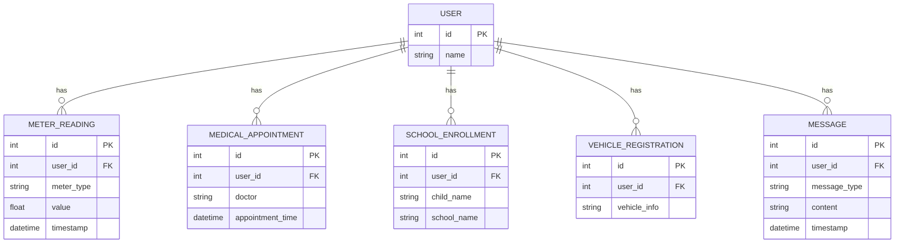

Эта схема описывает таблицы и их связи в базе данных:

- `USER`: Таблица пользователей.
- `METER_READING`: Таблица для хранения показаний счетчиков.
- `MEDICAL_APPOINTMENT`: Таблица для хранения записей к врачам.
- `SCHOOL_ENROLLMENT`: Таблица для хранения записей детей в школу.
- `VEHICLE_REGISTRATION`: Таблица для хранения информации о транспортных средствах.
- `MESSAGE`: Таблица для хранения сообщений, связанных с пользователями.

Каждая таблица связана с таблицей `USER` через внешний ключ `user_id`.