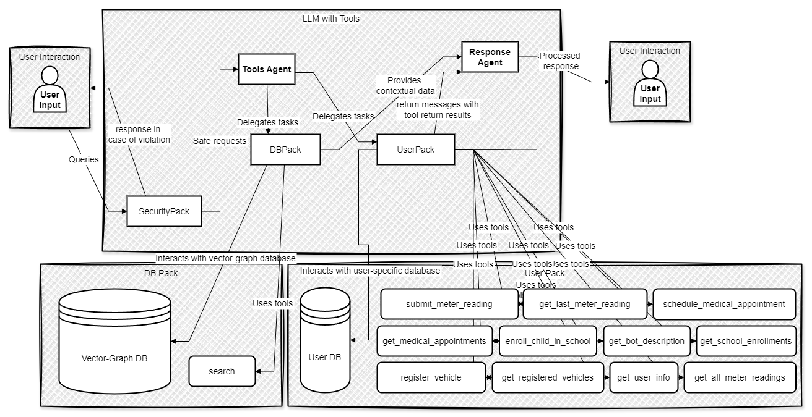

_Примечание: DBPack и UserPack являются программными модулями. При вызове инструментов моделью инструменты вызываются напрямую без посредников. Также, почти все инструменты используют базу данных из своего паката_

## Архитектура запросов:
1. **LLM**:
   - Основной агент, отвечающий на вопросы и использующий инструменты.
2. **SecurityPack**:
   - Проверяет запросы пользователя на безопасность и блокирует подозрительные инструкции.
3. **UserPack**:
   - Работает с пользовательскими данными, валидирует и сохраняет их в **User DB**.
   - Выполняет анализ запросов пользователя, связанных с его историей или текущими данными.
   - Использует инструменты для выполнения различных задач, таких как отправка показаний счетчиков, запись на прием к врачу, запись ребенка в школу и регистрация транспортных средств.
4. **DBPack**:
   - Подключается к графовой базе данных (**Graph DB**) для извлечения информации, связанной с контекстом или сложными зависимостями.
   - Предоставляет результаты запросов для формирования ответов.
   - Использует инструмент поиска для выполнения контекстных запросов.
5. **Базы данных**:
   - **User DB**: Хранит пользовательские данные (например, историю показаний).
   - **Graph DB**: Используется для обработки сложных запросов и обеспечения контекста.

---

### Пример сценария:
1. Пользователь запрашивает: _"Какие были последние показания горячей воды?"_
   - **LLM** идентифицирует запрос как относящийся к пользовательским данным и использует **UserPack**.
   - **UserPack** проверяет данные в своей базе и возвращает ответ в **LLM**.

2. Пользователь задаёт контекстный вопрос: _"Как мне зарегистрировать машину?"_
   - **LLM** использует **DBPack**, который выполняет вычисления на основе графовой базы данных.
   - Результат передаётся обратно через **LLM**.

---

### Данная архитектура подчёркивает:
1. Разделение обязанностей:
   - **UserPack** и **DBPack** обрабатывают строго свои области (пользовательские данные vs. графовые контексты).
2. Модульность:
   - У каждого сервиса своя база, что упрощает тестирование и масштабирование.