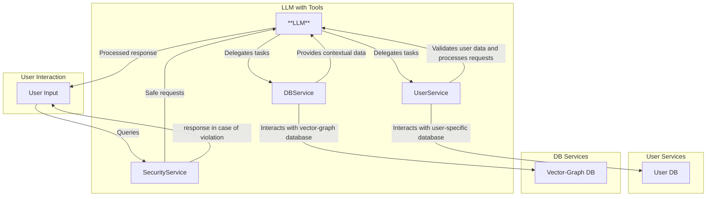

### Архитектура запросов:
1. **LLM**:
   - Основной агент, отвечающий на вопросы и использующий инструменты.
2. **SecurityService**:
   - Проверяет запросы пользователя на безопасность и блокирует подозрительные инструкции. 
3. **UserService**:
   - Работает с пользовательскими данными, валидирует и сохраняет их в **User DB**.
   - Выполняет анализ запросов пользователя, связанных с его историей или текущими данными.
4. **DBService**:
   - Подключается к графовой базе данных (**Graph DB**) для извлечения информации, связанной с контекстом или сложными зависимостями.
   - Предоставляет результаты запросов для формирования ответов.
5. **Базы данных**:
   - **User DB**: Хранит пользовательские данные (например, историю показаний).
   - **Graph DB**: Используется для обработки сложных запросов и обеспечения контекста.

---

### Пример сценария:
1. Пользователь запрашивает: _"Какие были последние показания горячей воды?"_
   - **LLM** идентифицирует запрос как относящийся к пользовательским данным и использует **UserService**.
   - **UserService** проверяет данные в своей базе и возвращает ответ в **LLM**.

2. Пользователь задаёт контекстный вопрос: _"Как мне узнать сколько воды я использовал за последний год?"_
   - **LLM** использует **DBService**, который выполняет вычисления на основе графовой базы данных.
   - Результат передаётся обратно через **LLM**.

---

### Данная архитектура подчёркивает:
1. Разделение обязанностей:
   - **UserService** и **DBService** обрабатывают строго свои области (пользовательские данные vs. графовые контексты).
2. Модульность:
   - У каждого сервиса своя база, что упрощает тестирование и масштабирование.